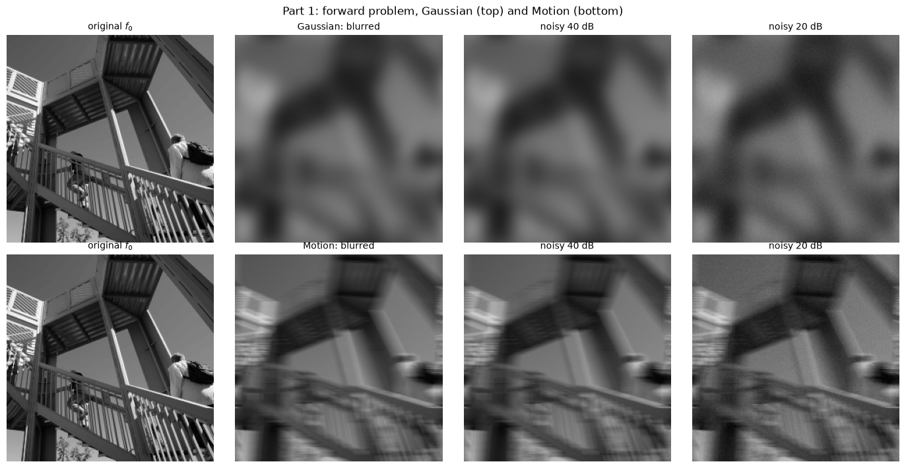
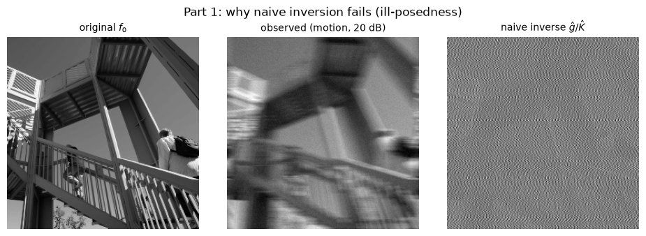
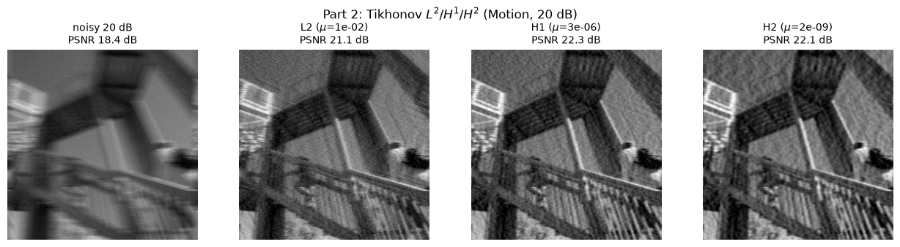
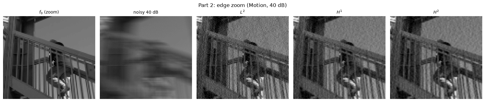
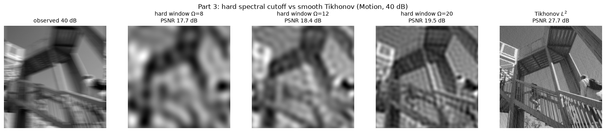
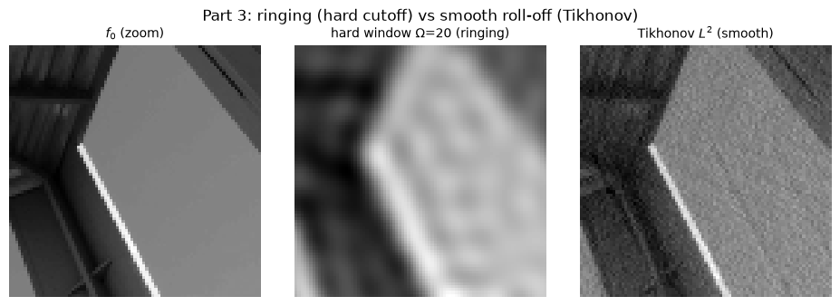
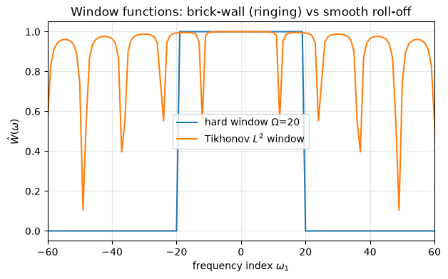
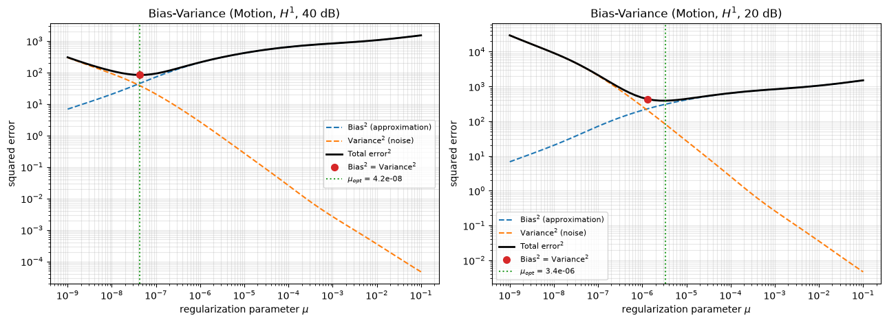

# Generalized Tikhonov Regularization & Error Analysis

**Mathematics for Imaging and Signal Processing, A.A. 2025/2026**

## 1. Problem and method

We recover a sharp image $f$ from a blurred, noisy observation $g = A f + w$, where $A$ is
convolution with a Point Spread Function and $w$ is additive Gaussian noise. In the Fourier domain
the model is pointwise, $\hat g = \hat K \hat f + \hat w$, so every operator is a multiplication by a
frequency mask. Direct inversion $\hat g / \hat K$ is ill-posed: where $\hat K \to 0$ the noise term
$\hat w / \hat K$ is amplified without bound.

Generalized Tikhonov regularization replaces the inversion with

$$\hat f_\mu(\omega) = \frac{\hat K^*(\omega)}{|\hat K(\omega)|^2 + \mu\,|P(\omega)|^2}\,\hat g(\omega),$$

where $P$ selects the penalty: $L^2$ ($|P|^2 = 1$), $H^1$ ($|P|^2 = \omega_1^2 + \omega_2^2$), and
$H^2$ ($|P|^2 = (\omega_1^2 + \omega_2^2)^2$). All physical quantities (transfer functions,
penalties, windows) are built on a centered frequency grid and shifted to FFT layout with a single
`ifftshift`, as in the assignment appendix. The image is a $256 \times 256$ grayscale photo
normalized to $[0, 1]$; noise is calibrated with
$\sigma_{\text{noise}} = 10^{-\text{SNR}_{dB}/20}\,\operatorname{std}(g_{\text{clean}})$.

Two blur models are used: a Gaussian blur (smooth, no zeros) and a linear motion blur (a sinc
transfer function with exact zeros at $|\omega| \approx N/L \approx 12$). Parts 2 to 4 use the motion
blur, whose zeros make the deblurring, the ringing, and the bias-variance effects most visible.

## 2. Part 1: Forward problem

The forward simulation reaches the target SNR exactly (40.00 dB and 20.00 dB, measured) for both
blurs.

Naive inversion of the motion-blurred, noisy data confirms the ill-posedness: dividing by a transfer
function that decays to $\approx 0$ (and has near-zeros) amplifies the noise until the reconstruction
leaves the $[0, 1]$ range entirely and shows no image content.

## 3. Part 2: L2 / H1 / H2 reconstructions (with edge zoom)

Each penalty is shown at its own PSNR-optimal $\mu$, since the useful $\mu$ scale differs by orders
of magnitude between methods ($|P|^2$ is $1$ vs $|\omega|^2$ vs $|\omega|^4$). The oracle choice is
legitimate here because the ground truth is known in simulation.

Full-image reconstructions, low-SNR scenario (20 dB):

Edge zoom on the railing, where the penalty differences are clearest:

At 40 dB the three penalties are within about 1 dB of each other; at 20 dB the differences become
visible. $L^2$ keeps the most high-frequency content and is the sharpest but grainiest; $H^2$ is the
smoothest but softens edges the most; $H^1$ is the best trade-off and gives the highest PSNR.

| Method | PSNR 40 dB | relL2 40 dB | PSNR 20 dB | relL2 20 dB |
|--------|-----------:|------------:|-----------:|------------:|
| Observed (no deblur) | 18.49 | 0.3015 | 18.43 | 0.3036 |
| $L^2$  | 27.69 | 0.1045 | 21.10 | 0.2234 |
| $H^1$  | **28.99** | **0.0901** | **22.28** | **0.1948** |
| $H^2$  | 28.99 | 0.0900 | 22.07 | 0.1996 |

## 4. Part 3: Spectral windowing (hard cutoff vs Tikhonov)

The hard cutoff $\hat f_\Omega = \hat W_\Omega\,\hat g / \hat K$ with
$\hat W_\Omega = \mathbb{1}[|\omega| < \Omega]$ is compared with the smooth Tikhonov filter, using the
motion blur at 40 dB so the ringing comes from the truncation itself and not from noise.

The brick-wall window is a discontinuity in frequency, which is equivalent to convolution with a sinc
in space; this produces ringing (Gibbs oscillations) parallel to strong edges. The Tikhonov filter,
with its smooth roll-off, does not.

The 1-D radial slice of the two windows shows the difference directly: a brick wall versus a smooth
decay.

## 5. Part 4: Bias-variance trade-off (H1)

The reconstruction error splits into two competing terms:

$$\text{Error}^2(\mu) = \underbrace{\|(R_\mu A - I) f_0\|^2}_{\text{Bias (approximation)}}
+ \underbrace{\|R_\mu w\|^2}_{\text{Variance (noise)}}.$$

Both terms are computed exactly in the Fourier domain via Parseval's identity, using the actual noise
realization from Part 1. The bias grows with $\mu$ (over-smoothing) and the variance falls (less noise
amplification), so the total error has an interior minimum.

The total-error minimum coincides with the bias = variance crossover:

| SNR | $\mu_{\text{opt}}$ | crossover $\mu$ |
|-----|-------------------:|----------------:|
| 40 dB | $4.24\times10^{-8}$ | $4.24\times10^{-8}$ (exact) |
| 20 dB | $3.35\times10^{-6}$ | $1.31\times10^{-6}$ (within the flat region) |

More noise (20 dB vs 40 dB) pushes $\mu_{\text{opt}}$ to a larger value, i.e. more regularization.
The $H^1$/20 dB optimum here ($3.35\times10^{-6}$) matches the PSNR-optimal $\mu$ from Part 2
($3.3\times10^{-6}$), confirming the two selection criteria agree.

*Note on the range.* The assignment suggests $\mu \in [10^{-6}, 1]$ as an example. Because the
penalty $|P|^2 = \omega_1^2 + \omega_2^2$ is built on the raw integer frequency grid (indices up to
$N/2 = 128$, so $|P|^2$ reaches $\approx 3.3\times10^4$), the $H^1$ optimum lands near
$10^{-8}$ to $10^{-6}$. The sweep is therefore shifted to $\mu \in [10^{-9}, 10^{-1}]$, the same
logarithmic range, so the optimum is bracketed with both tails visible.

## 6. Discussion: smoothness order vs edge preservation

The Tikhonov filter is a soft, frequency-dependent low-pass,
$\hat W_\mu = |\hat K|^2 / (|\hat K|^2 + \mu |P|^2)$, close to $1$ where the signal dominates and close
to $0$ where noise does. The penalty order sets how fast this window decays with frequency:

- **$L^2$** ($|P|^2 = 1$) damps high frequencies roughly uniformly. It keeps the sharpest edges of the
  three, but suppresses noise the least and looks grainy at low SNR.
- **$H^1$** ($|P|^2 = |\omega|^2$, penalizing $\|\nabla f\|^2$) damps high frequencies more strongly.
  The result is smoother with softened edges and good noise suppression.
- **$H^2$** ($|P|^2 = |\omega|^4$, penalizing the Hessian) makes the window decay as $|\omega|^{-4}$.
  This gives the strongest noise suppression and the best denoising in flat regions, but the worst
  edge fidelity: edges are visibly blurred.

So increasing the smoothness order trades edge sharpness for noise suppression. Ordering by sharpness
is $L^2 > H^1 > H^2$; ordering by smoothness is $H^2 > H^1 > L^2$. This is visible in the Part 2 edge
zoom and consistent with the PSNR table, where $H^1$ is the best compromise. The effect is clearer at
40 dB, where high frequencies survive the noise; at 20 dB all three converge toward heavy smoothing.

Compared with the hard spectral cutoff, the two approaches suppress high frequencies similarly on
average, but the abrupt cutoff introduces ringing near edges while the smooth Tikhonov roll-off does
not. All quadratic penalties over-smooth edges because they penalize large gradients quadratically;
edge-preserving alternatives such as Total Variation (an $L^1$ gradient penalty) exist but are
non-linear and have no closed-form FFT solution.

## Reproducibility

All results are deterministic from a fixed seed. Run the module self-test with
`python tikhonov_deblurring.py`, or open `deblurring_project.ipynb` and use *Restart & Run All*; the
final cell re-checks the main invariants (SNR targets, transfer-function properties, Tikhonov beating
the naive inverse, bias-variance monotonicity, and Fourier-vs-spatial agreement).
